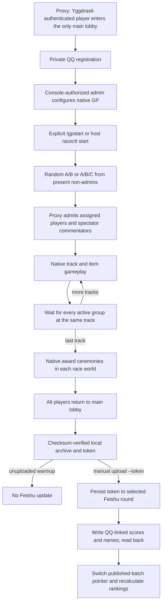

# Live system dependency graph

This document describes the current **manual token** design, not the retired seven-round roster exporter. Exact commands are in `docs/OPERATIONS.md`; deployment and backup paths are in `docs/SETUP.md`.

The gameplay daemon makes no periodic Feishu calls. The only background work is local administrator-command handling, per-track barrier coordination, native completion collection and archiving. All cloud mutations are explicit CLI operations. Each server reports one immutable attempt/group with a QQ and nickname snapshot; administrators never enter the score roster. No published result is inferred from proxy presence, signup, or a partially finished GP.

Verification is tiered: the real native client proves the route and lifecycle exercised; local two-player tests cannot prove 51-player capacity. See `docs/verification/README.md` for evidence and limitations. The pinned Minecraft/Bungee/runtime artifacts stay unchanged; the proxy QQ gate is a narrowly scoped custom plugin, not a replacement game server.
