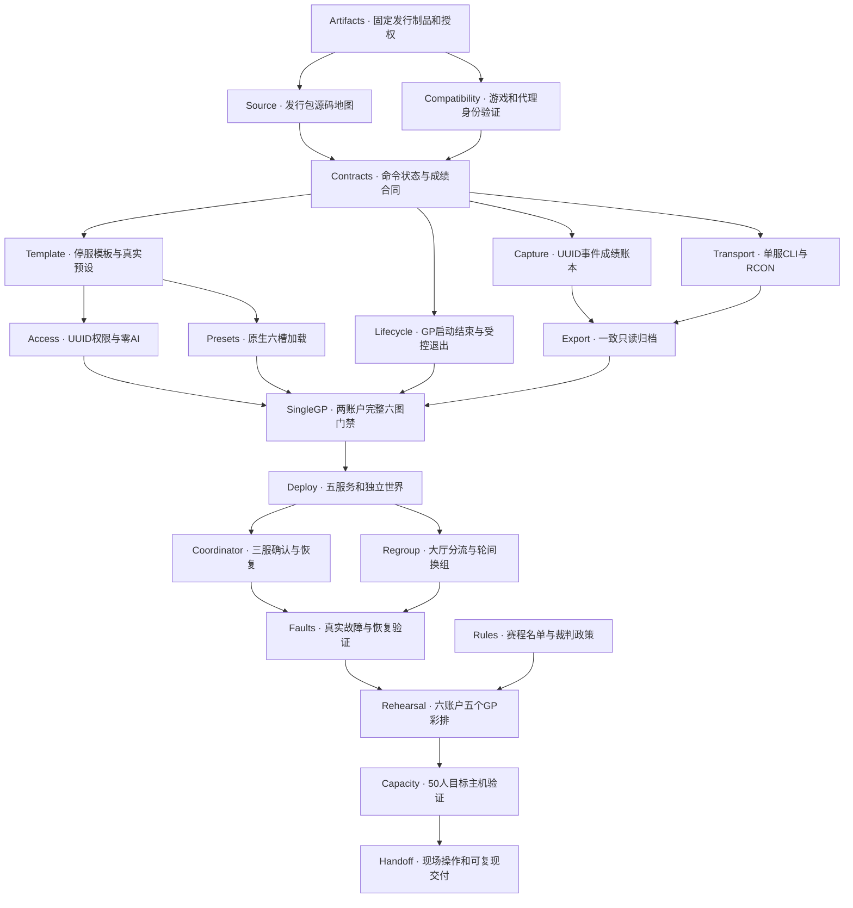

# Sprint Racer 实施依赖图

状态：**可运行实现与本地受控联机验证已交付；目标主机容量门禁未通过。** 实测使用原版Minecraft26.2、BungeeCord2096及六个真实26.2离线客户端。源码/文档与证据索引见 `docs/verification/README.md`；不能把受控完赛事件注入当作真人驾驶成绩，也不能把本机验证当作50人容量认证。

## 1. 已定决策

- 每 GP **6 张确定 Race 赛道**，计划 **5 个 GP**。每组选手最多跑 30 场地图赛；A/B/C 共 90 次地图赛实例。不是原生固定六场，也不是五场截断；复用原生可配置序列及轮内自动推进。
- A/B/C 同轮同一序列；GP 内分组固定，完成六图、冻结、三服留档后才允许重新随机分组。允许跨 GP 重复赛道，不要求 30 张互异地图。
- **AI 禁用、实际 AI 参赛数量恒为 0**，包括人数不足、掉线、重连、换图和重启路径；不开发 AI 名次补偿逻辑，不广泛清除玩法实体。
- 保留原生赛车、道具和结算呈现；赛事 datapack 只控制公共设置、生命周期、名单和结果记录。
- Python 一次性 `racectl`；通过 Docker exec 调用容器本地 RCON；无常驻控制台、Web 后台、中心数据库或消息队列。
- 成绩在事件发生时捕获；export 只读；宿主机保存不可覆盖的 JSON/CSV/manifest 和归档回执。
- 初期不安装第三方玩法/计分/权限/导出插件。BungeeCord 所需内置命令模块与代理同 build；不用 Velocity、Multiverse、ViaVersion 或 NPC 插件替代兼容性验证。
- 外部活动积分每人每 GP 一笔；飞书写入、抽奖、积分曲线执行不在此项目范围。
- 身份政策已由用户改定：**私有可信活动、离线客户端、仅宿主机管理**。代理关闭正版认证；离线UUID只作稳定键，不能证明人，也不能授予管理权限。组织者监督并接受名字冒用风险；默认只绑定localhost，禁止无保护公网部署。兼容性测试可使用合法受控离线客户端。

## 2. 版本基线与证据等级

发行制品与当前运行栈均有取证。`compatibility.json`、`single-gp.json`、`rehearsal.json`、`faults.json`、`deployment.json` 分别记录不同验证范围；证据只能支持其明确描述的范围。M4 Mac mini尚未可用，Capacity和最终赛事发布验收继续阻塞。

| 组件 | 本计划选定基线 | 已核实证据 | 仍须完成 |
| --- | --- | --- | --- |
| 世界 | Sprint Racer **1.6.13**，CurseForge file **8422262** | 已下载、hash锁定、以实际发行ZIP构建补丁；许可原文要求不再发布世界 | 活动方仍负责其活动使用范围；仓库不包含原版世界 |
| 客户端/游戏 | Minecraft Java **26.2**，协议 **776** | 六个真实26.2离线客户端成功登录、换服、重连；UUID稳定 | 不代表真实身份认证或50人负载 |
| 大厅/比赛服 | **原版 Minecraft 26.2** | 锁定Mojang制品；两个真实离线客户端成功登录/换服、渲染、移动和使用原生道具；完整六槽控制流程已实测 | 全套三组五轮彩排与50人容量仍需各自证据；Paper128仅保留比较制品，不再部署 |
| 代理 | **BungeeCord build2096** | 已下载/hash校验、实际运行、与原版离线后端共同使用；`ip_forward:false` | 生产事件网络防火墙需在目标主机配置 |
| 代理模块 | **build2096 的 cmd_server、cmd_send** | 显式装载固定JAR；六客户端的主机分流及轮间换组回读成功 | 客户端没有send管理权限；禁止自动拉取latest |
| Java/镜像 | **Temurin25.0.4+7 / Noble**，固定多架构digest | 本机arm64容器实际启动并运行全部后端 | 目标M4主机尚未验证容量；Docker无硬CPU/RAM上限，JVM堆可配置 |
| 第三方插件 | **无** | 降低版本与玩法变更面 | 只有真实证明 storage/RCON 不满足接口时，才提出具体只读桥接插件及新版本/回归门禁 |

已取得的固定制品定位：

- Paper 元数据：<https://fill.papermc.io/v3/projects/paper/versions/26.2/builds/128>
- Paper SHA-256：`85efd679ac1b5c0133aa53ea4222fcdc65b8a5b0d7f4e85497b64747f19634aa`
- Paper 下载：<https://fill-data.papermc.io/v1/objects/85efd679ac1b5c0133aa53ea4222fcdc65b8a5b0d7f4e85497b64747f19634aa/paper-26.2-128.jar>
- 部署使用原版制品：`mojang_26.2.jar`，SHA-256 `cdacdfb25898de5e4b4b0e5ddcc2722f77067e46605709c2d886c000ebb63ec5`，<https://piston-data.mojang.com/v1/objects/823e2250d24b3ddac457a60c92a6a941943fcd6a/server.jar>。用户批准离线私有活动后，代理/后端同名各自计算离线UUID，`ip_forward:false`；不声称认证真实身份。Paper默认RCON输出有截断；原版和Paper均观察到原生ItemFrame日志，不能误称该日志为Paper独有问题。
- BungeeCord 固定构建：<https://hub.spigotmc.org/jenkins/job/BungeeCord/2096/>
- BungeeCord JAR：<https://hub.spigotmc.org/jenkins/job/BungeeCord/2096/artifact/bootstrap/target/BungeeCord.jar>
- Temurin 镜像：`eclipse-temurin:25-jre-noble@sha256:b573af9e331196fbc42e246da4df24df9b6c556c73e7efddfde0511f1c9508c5`。tag 只作说明，digest 决定内容；已见 `linux/amd64`、`linux/arm64/v8`，不得强制本地 ARM 运行 amd64 模拟来冒充容量验证。
- Adoptium API 另列出 25.0.4.1+1 JRE，但本次查询对应 `25.0.4.1_1-jre-noble` Docker tag 不存在。因此不臆造镜像 tag；Artifacts 门禁须审阅该补丁差异，若需要升级，则按可获取制品重新锁 digest 并重过 Compatibility，而不是运行时自动升级。

世界ZIP、Mojang/Paper比较包、Bungee及模块hash已实际计算并写入 `config/versions.lock.json`；模板hash由 `scripts/prepare-template` 生成在本地receipt中。主机Python使用标准库、system curl负责TLS；RCON及严格SNBT编解码在 `raceops/`。已用原生RCON验证超过24KB的分块请求与完整回读；无猜测hash、无关闭TLS校验。

开发参考 commit `049f3821dede74e22b4484265dfe907cc2d34453` 要求数据包格式 121，而 Minecraft 26.2 为 107.1。参考源码可定位风险，但不能直接部署或当成已审计发行包。

## 3. 完整依赖 DAG

实线为实施及最终验收依赖。已实现节点不再标为PLANNED；受控客户端已完成5个GP×6图×3组的生命周期/留档/换组验证。用户选择未决体育规则保留人工裁定，不伪造最终排名。Capacity因目标M4主机未提供而阻塞；SETUP/OPERATIONS可用于本地运行，但不等于全量赛事发布验收。

最快的首次行为证据是 **Artifacts → Source/Compatibility → Contracts → 单服各分支 → SingleGP**。这是完整六图、权限和离线成绩的纵向交付，不是空 Compose 或模拟 CLI。三实例实现不应先于该门禁；世界布局、证据格式和部署设计可提前确定，不提前宣称五服务可用。

## 4. 节点交付与退出条件

依赖列是调度合同，与图逐边一致。任何节点失败均保持其门禁关闭，不通过静默改版本、禁用检查或清空数据来“继续”。

| 节点 | 直接前置 | 交付目标/主要文件 | 可观察退出条件 |
| --- | --- | --- | --- |
| Artifacts | — | `config/versions.lock.json`、`scripts/fetch-assets`、固定镜像输入和本地 `downloads/` | 正式 URL/build/commit/hash 可复现；错误/缺失 hash 拒绝；许可范围与资源包分发明确；需要启动前由部署者接受 EULA；不提交原版世界或资源 |
| Rules | — | `config/event.yaml`、裁判规则及名单导入约定 | 固定 5 GP × 6 图、0 AI；确认超时、DNS/DNF、掉线/重连、未完成 GP、平分、重赛有效 attempt、开赛偏差阈值和人工裁定方式；未确认则 export 标待裁定，不造规则 |
| Source | Artifacts | `docs/SOURCE_MAP.md`、`patches/manifest.json` 的上游输入映射 | 发行包逐入口列出权限、ready/skip、六槽写入、每图真正起跑、finish/award/settlement、GP结束/loop/退出及 AI 补位路径；记录文件 hash/行号/调用者/未知项；每个未知项分配验证场景 |
| Compatibility | Artifacts | `images/`、`compat.compose.yaml`、`scripts/compat`、`docs/verification/compatibility.json` | 固定Java/原版26.2/Bungee正常加载；离线登录与重连/换服UUID一致；明确UUID不认证人；后端端口不发布；客户端无OP/admin/代理管理组；资源包、运动和道具实际验证 |
| Contracts | Source, Compatibility | `config/contract.json`、`raceops/model.py`、`patches/xdu_race/` | 请求、状态、六图成绩与离线身份合同共用，版本不一致拒绝控制 |
| Template | Contracts | `scripts/prepare-template`、本地 `template-world/`、模板 manifest、`config/presets.yaml`、真实赛道目录 | 管理模式开启、AI与补位关闭、GP循环关闭、固定其他设置；五个预设均有六个真实且唯一解析的已安装 Race 槽位；无临时比赛记录混入；停服后按定义的不可变内容生成模板 hash |
| Access | Template | `patches/xdu_race/function/access/`、公共变更入口补丁、离线UUID参赛名册 | 仅宿主机可管理；冒用任何名字也不能获OP/admin；普通选手不能改设置/选图/ready/取消，道具可用；错误组/迟到者不得加入本GP；一人/离线也不补AI；重启/换图仍零AI |
| Presets | Template | `patches/xdu_race/function/preset/`、原生六槽写入补丁 | 仅通过已验证的游戏内入口写六槽和顺序；原生长度6、loop关闭、每槽恰一赛道、无 Save State 附带变更；读回与预设一致；不存在/禁用/歧义赛道报错且不随机替补；非赛道设置摘要不变 |
| Lifecycle | Contracts | `patches/xdu_race/function/control/`、实际 launch/end/cancel 补丁 | 首图只接受受信 gate，第2–6图原生自动推进，第7图拒绝；prepare不产生比赛；同attempt重复start不重启；结算完成才freeze；stop阶段受控，reset无运行中/未归档通道；使用 Capture/Access/Presets 合同，集成由 SingleGP 验证 |
| Capture | Contracts | `patches/xdu_race/function/results/`、start/finish/settlement钩子、独立storage | 真正起跑才记started；同一成绩键只写一次；完赛即捕获raw名次/award；结算另记原生总分；退出/换图不删历史；六图冻结；断线状态和待裁定明确；非法AI污染可见；不按当前在线集合或当前旁观模式丢人 |
| Transport | Contracts | `scripts/racectl`、`raceops/transport.py`、`raceops/rcon.py`、`raceops/snbt.py` | 实际单服/三服命令和确认；原生RCON限长分块、全交换互斥、Unicode与完整回读；真实并发复现修复后1200命令通过 |
| Export | Capture, Transport | `scripts/export-results`、`raceops/exporter.py`、JSON/CSV/manifest | 只读查询与revision检查；离线UUID与六图明细；重复导出键不重复；归档snapshot/hash验证授权reset |
| SingleGP | Access, Presets, Lifecycle, Export | `docs/verification/single-gp.json`、仅本地原始归档 | 两个账户完整跑六图且零AI；误触ready无效；测试途中断线与完赛后结算前离开；对照HUD；全员离线重复导出一致的逻辑成绩；结束/stop/reset安全，第7图不开始。失败回到所属实现分支，不继续扩容 |
| Deploy | SingleGP | `compose.yaml`、`scripts/init-worlds`、proxy/lobby配置、secrets约定 | 仅proxy公开；容器非root且世界不共享；从停止模板创建A/B/C，仅不存在目标可复制；运行中/非空目标拒绝；启动实际探针通过；固定资源/版本/模板hash一致；既有server.properties和历史数据不覆盖 |
| Coordinator | Deploy | `raceops/cli.py`、主机锁、`volumes/control/operations.jsonl` | 三服prepare/start/回读；真实部分开赛与不可达场景拒绝误重启；审计与归档先行，不自动回滚已有成绩 |
| Regroup | Deploy | `config/rosters/round-N.json`约定、管理者分流操作卡、proxy命令模块配置 | 每轮名册UUID唯一且跨组互斥；比赛途中普通玩家换服不改变参赛名单；管理员可送回大厅；仅在三服完成留档后重新随机分组、导入下一轮名册并验证；资源包切换无重复提示。先用人工随机分组和受控命令，不开发菜单/分组服务 |
| Faults | Coordinator, Regroup | `docs/verification/faults.json`、必要的行为回归测试 | 实际注入一服不可达/命令超时/部分start/控制器中断/服重启；覆盖错误预设、重复start、并发CLI、无归档reset、混合阶段stop；保留历史且没有双重记分或未知状态自动重开；读取期间换图可检出不一致 |
| Rehearsal | Faults, Rules | `docs/verification/rehearsal.json`、五轮对应三组manifest | 至少6个真实或合法受控账户、每服2人；完整5个GP×6图，中间重新分组；全程0AI、没有第7图；五轮均可按round/attempt查回并对照名册/HUD/裁判规则；有效attempt不重复累计 |
| Capacity | Rehearsal | 目标主机规格、资源配额、`docs/verification/capacity.json` | 50个真人或合法受控客户端按17/17/16实际参加/使用道具；观测TPS/MSPT、GC、内存、CPU、磁盘、资源包下载和网络；满载进行导出/换图。验收阈值事先固定、无OOM/watchdog/持续积压；不把空闲连接或本地笔记本冒充生产容量 |
| Handoff | Capacity | `docs/SETUP.md`、`docs/OPERATIONS.md`、最终锁文件/补丁/验收索引 | 干净部署者按文档从授权制品建立模板、一条命令起服务并完整操作；现场卡包含失败恢复、归档校验、换组及重赛；所有版本与证据对应同一配置，明确容量适用主机；没有未通过的发布门禁 |

## 5. 跨分支接口与所有权

### 5.1 状态和命令

- 后端拥有真实赛事状态；主机拥有操作journal与归档回执。二者不可互相猜测覆盖。
- 状态：`IDLE`、`PRESET_LOADED`、`ARMED`、`RUNNING`、`BETWEEN_TRACKS`、`GP_FINISHED`、`STOPPED`、`ERROR`。**不设置世界内 EXPORTED 状态。**
- round是活动第1–5个GP，track_index是该GP第1–6张图，attempt是该GP的一次实际尝试；三者不得混用。
- 每次后端状态快照包含：schema/adapter版本、event_id、group/server、round、attempt_id、boot_id、revision、state、track_index、preset_id、preset_hash、template_hash、settings_hash、roster_hash、ai_count、已确认operation_id和只读在线状态。
- revision仅随赛事事实/记录变更，不因每tick或查询递增；实时在线集合附独立采样时间，不承诺和多包历史读取同tick。新boot必须可识别；不得用一次reload清空历史。
- 命令请求包含operation_id、payload_hash和expected state/round/attempt/revision。相同ID相同请求回读已知结果；相同ID不同请求拒绝；新ID重复start同attempt仍不重启。状态变化后不能重放旧prepare/start。
- `preset <id> --round N`读取本地该轮名册并显式选择GP；`start`只处理当前已装载attempt；`export --round N [--attempt ID]`读历史；`stop --reason ...`受阶段约束，运行中须`--force`；`reset --reason ...`必须校验三服归档，既不删除历史也不自动开始下一GP。
- prepare/commit/start均由后端在实际执行时再检查前置条件，不能只靠主机先前status抵御状态竞争。自动进入下一图也经过同一验证边界。
- 名单确认须包括当前参赛者与计划名册的差异，是否允许缺席由Rules决定；不得让在线的任意玩家自动进入名册。

### 5.2 数据与归档

- 赛中持久键：`(event_id, gp_round, attempt_id, group, track_index, uuid)`；姓名是name_at_start快照，不是主键。每轮每图缺席者也有明确状态，不只输出完赛者。
- Capture记录原始finish_pos、获授award、起跑/完赛事实、server tick、结算标记与原生累计分数。Export不在读取时补写这些信息，不因离线抹掉记录。
- freeze仅发生在第6图结束且所需结算完成后；原生points存在不代表settled。stop产生的中断快照和自然完赛冻结快照必须可区分。
- `tracks.csv`每人每图一行；`grand_prix.csv`每人每GP attempt一行，含六图状态。正常完赛人可给真人名次；未完成/数据异常/未裁定不能冒充正常末名。外部积分不在导出中计算。
- 冻结结果不可变；人工裁定以带来源/版本的附加记录体现，不改写原始事实。若只在飞书裁定，导出继续标待裁定，不能声称已裁定。
- Export分块读取前后检查boot/attempt/revision，有限重试；失败不修改游戏。manifest带每服状态/时间/revision、所有版本/hash、记录数量、文件hash、警告/错误、是否完整及是否待裁定。
- 存储路径按event/round/attempt/export-id隔离；临时目录写完并校验后原子发布。完整回执仅在三服均成功且文件hash校验通过后成立；partial归档不能授权全局reset。
- 当前attempt的归档须匹配最终冻结revision，不可拿较早的中途快照授权reset；已STOPPED/ERROR需要明确裁定/恢复路径，不能借reset绕过不确定状态。
- 数据包storage仍依赖Minecraft保存机制；不承诺进程被杀前最后一个tick已落盘。崩溃后无法证明完整的attempt标为ERROR/待裁定；绝不在export中用save-all补救。

### 5.3 并行工作边界

Contracts完成后可以同时开发Lifecycle、Capture、Transport，以及Template完成后的Access和Presets；Export等待Capture/Transport的真实接口。它们是本图的开发并行点，不是要求现在启动实现。

- 各分支只拥有自己命名目录和模块；不得同时编辑同一个上游mcfunction。
- **单一集成者**拥有`patches/manifest.json`、所有共享原版入口的最终补丁、schema变更和SingleGP集成。分支提交自己的hook及精确插入点需求，集成者序列化最小共享改动。
- 不用临时mock结果宣称端到端通过；开发分支合并后集中运行集成验证，避免验证相互未完成的修改。
- 不复制第二份预设/状态真值；CLI与datapack共用Contracts定义，版本不一致拒绝控制。

## 6. 门禁场景与阻塞输入

| 场景 | 通过条件 | 主要负责节点 |
| --- | --- | --- |
| 六图终结 | 实际跑完1–6图；第6图完成结算和冻结；无第7图；下一GP可独立运行 | Lifecycle, SingleGP, Rehearsal |
| 零AI | 一人开赛、掉线/重连、六图切换、重启均不补AI；注入AI配置时拒绝下一图并标异常，不过滤后声称正常 | Access, Presets, Faults |
| 身份和权限 | 离线UUID全链路稳定但不冒充身份证明；后端绕接失败；客户端无管理权限；普通道具正常而生命周期不可改 | Compatibility, Access |
| 离线成绩 | 起跑后离线、完赛后结算前离线、全员离线均保留名单与已捕获事实 | Capture, Export, SingleGP |
| 导出不干扰 | 不发任何世界写命令；查询不推进/暂停比赛；大响应完整；不一致快照明确失败；重复导出无逻辑重复 | Export, Faults |
| 三服部分失败 | 区分确认成功/失败/未知；未启动服不伪装成功；已产生结果不被自动回滚；可按审计恢复 | Coordinator, Faults |
| 重启和重赛 | 保留历史attempt；未知连续性必须裁定；有效attempt显式选择，重新导出不重复累计 | Capture, Coordinator, Faults |
| 50人 | 目标主机17/17/16真实负载达成预先固定指标；资源包分批预缓存有效 | Capacity |

需要在对应节点到达前提供/确认的外部输入（不阻止其他无依赖节点工作）：

1. 部署者EULA接受与世界/资源包的活动使用和分发范围：Artifacts/Compatibility。
2. 组织者核验的离线名字/UUID名册、合法受控测试客户端、五轮赛道与公共设置：Template/Access/SingleGP。无客户端管理员白名单；实际管理凭据仅宿主机保管。
3. DNF/DNS/平分/未完成GP/掉线及重赛裁判规则：Rules；未确定前不能生成冒充已确认的总名次。
4. 统一资源包可访问URL、生产网络/主机规格和50人测试资源：Compatibility/Deploy/Capacity；不得把本机Docker约7.75GiB配置当成已验证容量。

## 7. 来源

- Sprint Racer发行：<https://www.curseforge.com/minecraft/worlds/sprint-racer/files/8422262>
- Minecraft 26.2：<https://www.minecraft.net/en-us/article/minecraft-java-edition-26-2>
- 开发参考pack元数据：<https://github.com/jarrodmmoore/Sprint-Racer-Dev/blob/049f3821dede74e22b4484265dfe907cc2d34453/datapacks/sr_code/pack.mcmeta>
- Paper build128：<https://fill.papermc.io/v3/projects/paper/versions/26.2/builds/128>
- Paper Java版本要求：<https://docs.papermc.io/paper/getting-started/>
- BungeeCord build2096：<https://hub.spigotmc.org/jenkins/job/BungeeCord/2096/api/json>
- BungeeCord固定源码协议声明：<https://github.com/SpigotMC/BungeeCord/blob/502ca712d063eab7c2e4d0810f7de896327bbce5/protocol/src/main/java/net/md_5/bungee/protocol/ProtocolConstants.java>
- BungeeCord UUID转发：<https://www.spigotmc.org/wiki/bungeecord-ip-forwarding/>
- Paper转发设置：<https://docs.papermc.io/paper/reference/spigot-configuration/#settings_bungeecord>
- Temurin镜像元数据：`docker buildx imagetools inspect eclipse-temurin:25-jre-noble`；上文保存的是本次返回的固定digest，不是将来重查tag的结果。
